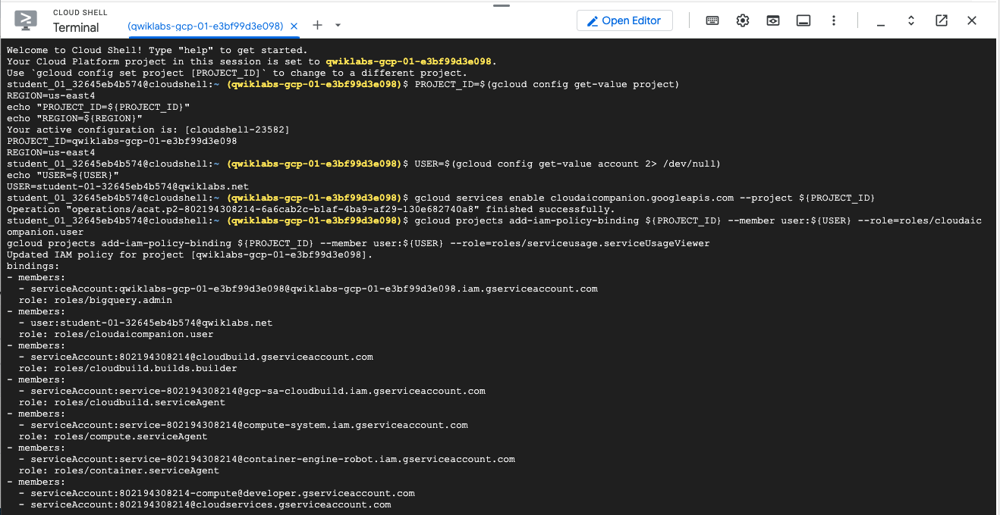
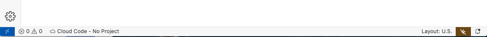
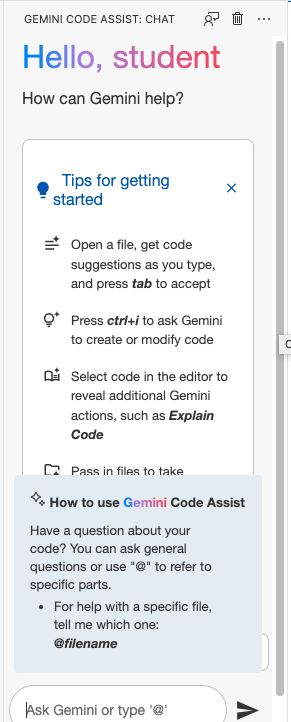
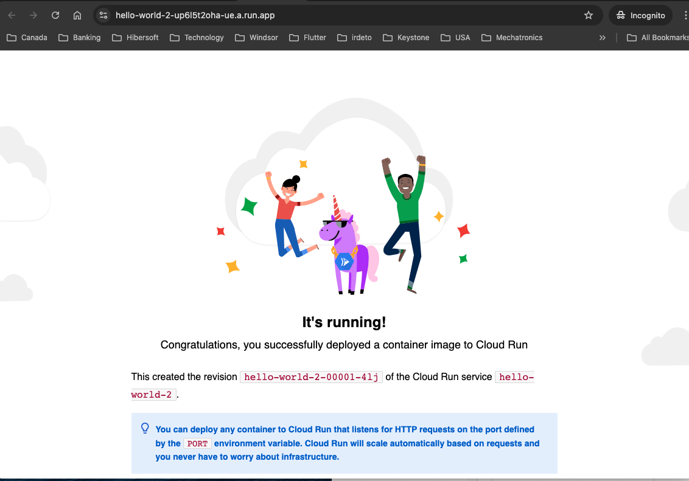

# GCP-LAB-Develop-an-app-with-Gemini
Develop an app with Gemini

##### Overview

In this lab, you use Gemini, an AI-powered collaborator in Google Cloud, to explore, create, modify, test, and deploy a sample app.

You use Cloud Workstations to create a development environment that uses Code OSS as the IDE. You use Gemini Code Assist in Cloud Code to understand code and build a sample inventory app that has two API methods. You also use Gemini to generate the steps for deploying your app to Cloud Run.

This lab is intended for developers of any experience level who contribute to building apps but might not be familiar with cloud application development. It helps to have some experience using VS Code or Code OSS as your IDE and to be familiar with Python and the Flask framework.

>Note: Duet AI was renamed to Gemini, our next-generation model. This lab has been updated to reflect this change. Any references to Duet AI in the user interface or documentation should be treated as equivalent to Gemini while following the lab instructions.

>Note: As an early-stage technology, Gemini can generate output that seems plausible but is factually incorrect. We recommend that you validate all output from Gemini before you use it. For more information, see Gemini for Google Cloud and responsible AI.


###### Objectives
In this lab, you learn how to perform the following tasks:

. Create a cloud-based application development environment by using Cloud Workstations.
. Explore various Google services that you can use to deploy an app by asking Gemini context-based questions.
. Prompt Gemini to provide templates that you can use to develop a basic app in Cloud Run.
. Create, explore, and modify the app by using Gemini to explain and generate the code.
. Run and test the app locally, and then deploy it to Google Cloud by using Gemini to generate the steps.

### Task 1. Configure your environment and account
1. Sign in to the Google Cloud console with your lab credentials, and open the Cloud Shell terminal window.

2. To set your project ID and region environment variables, in Cloud Shell, run the following commands:

```
PROJECT_ID=$(gcloud config get-value project)
REGION=us-east4
echo "PROJECT_ID=${PROJECT_ID}"
echo "REGION=${REGION}"
```

3. To store the signed-in Google user account in an environment variable, run the following command:

```
USER=$(gcloud config get-value account 2> /dev/null)
echo "USER=${USER}"
```

4. Enable the Cloud AI Companion API for Gemini:

```
gcloud services enable cloudaicompanion.googleapis.com --project ${PROJECT_ID}
```

5. To use Gemini, grant the necessary IAM roles to your Google Cloud Qwiklabs user account:

```
gcloud projects add-iam-policy-binding ${PROJECT_ID} --member user:${USER} --role=roles/cloudaicompanion.user
gcloud projects add-iam-policy-binding ${PROJECT_ID} --member user:${USER} --role=roles/serviceusage.serviceUsageViewer
```

Adding these roles lets the user use Gemini assistance.





### Task 2. Create a Cloud Workstation

This lab uses Gemini assistance to develop an app with the Cloud Code plugin for Cloud Workstations IDE. Cloud Workstations is a fully managed integrated development environment that includes native integration with Gemini.

In this task, you configure and provision your Cloud Workstation environment, and you enable the Cloud Code plugin for Gemini.

View the workstation cluster
A workstation cluster named my-cluster has been pre-created for this lab. This cluster is used to configure and create a workstation.

1. On the Google Cloud console title bar, type Cloud Workstations in the Search field, then click Cloud Workstations in the search results.

2. In the Navigation pane, click Cluster management.

3. Check the Status of the cluster. If the status of the cluster is Reconciling or Updating, periodically refresh and wait until it becomes Ready before moving to the next step.


###### Create a workstation configuration
Before creating a workstation, you must create a workstation configuration in Cloud Workstations.

1. In the Navigation pane, click Workstation configurations, and then click Create Workstation Configuration.

2. Specify the following values:

| Property	| Value |
| Name	| my-config |
| Workstation cluster |	select my-cluster |

3. Click Create.

4. Click Refresh.

5. Check the Status of the configuration being created. If the status of the configuration is Reconciling or Updating, periodically refresh and wait until the status becomes Ready before moving to the next step.


###### Create a workstation

1. In the Navigation pane, click Workstations, and then click Create Workstation.

2. Specify the following values:

| Property	| Value |
| Name	| my-workstation |
| Configuration	| select my-config |

3. Click Create.

After the workstation is created, it is listed under My workstations with a status of Stopped.

4. To start the workstation, click Start.

As the workstation starts up, the status changes to Starting. Wait for the status to change to Running which indicates that it is ready to be used. It might take several minutes for the workstation to fully start up.


###### Launch the IDE

To function properly, some extensions need third-party cookies to be enabled in your browser.

1. To enable third-party cookies in Chrome, in the Chrome menu, click Settings.

2. In the search bar, type Third-party cookies.

3. Click the Third-party cookies setting, and select Allow third-party cookies.

>Note: If you want to restore your browser to its current settings after the lab, note the original setting for third-party cookies.

. To launch the Code OSS IDE on the workstation, from the Workstations page in the Google Cloud console, click Launch.

The IDE opens in a separate browser tab.


### Task 3. Update the Cloud Code extension to enable Gemini
In this task, you enable Gemini in Cloud Code for your Workstation IDE.

###### Connect to Google Cloud

To connect to Google Cloud in your workstation, perform these steps:

1. At the bottom of the window, on the status bar, click Cloud Code - Sign In.


2. To launch the Cloud Cloud sign-in flow, press Control (for Windows and Linux) or Command (for MacOS) and click the link in the terminal.

3. If you are asked to confirm the opening of the external website, click Open.

4. Click the student email address.

5. When you're prompted to confirm that you downloaded this app from Google, click Sign in.

Your verification code is displayed in the browser tab.

>Note: You may see a warning that you ran a gcloud auth login command. This process is normal. The IDE ran this command on your behalf.

6. Click Copy.

7. Back in the IDE, in the terminal, where it says Enter authorization code, paste the code.

8. If asked to approve copying from the clipboard, click Allow.

9. Click Enter, and then wait for the status bar to show Cloud Code - No Project.

You're now connected to Google Cloud.



###### Enable Gemini in Cloud Code
To enable Gemini in Cloud Code for your workstation IDE, perform these steps:

1. In your workstation IDE, click on the Manage icon (Code OSS main menu) in the bottom left corner, then click Settings.

2. On the User tab of the Settings dialog, select Extensions > Gemini Code Assist.


3. In Search settings, enter Gemini.

4. On the Qwiklabs lab credentials panel, to copy the Project ID, click Copy.


5. On the Cloud Code settings page, for Geminicodeassist: Project, paste the Google Cloud project ID.

6. Confirm that Geminicodeassist: Enable is enabled.

7. In the IDE status bar, click Cloud Code - No Project.

8. Click Select a Google Cloud Project, and then click your project ID.


### Task 4. Chat with Gemini
Gemini can help you choose the Google Cloud services that meet the requirements of your application architecture. If you want to develop and test your app in your local IDE, and then deploy it to Google Cloud, you can chat with Gemini to get help.

In this task, you use the Gemini Code Assist pane to enter prompts and view the responses from Gemini.

Prompts are questions or statements that describe the help that you need. Prompts can include context from existing code that Google Cloud analyzes to provide more useful or complete responses. For more information on writing prompts to generate good responses, see Write better prompts for Gemini in Google Cloud.

##### Prompt Gemini

To prompt Gemini about Google Cloud services, perform these steps:

1. To open the Gemini chat pane, in the IDE activity bar, click Gemini Code Assist (Code OSS Gemini menu).

>Note: You may see a warning that you are missing a valid license. You may ignore this message for this lab.

2. If an error occurs when trying to open the Gemini chat pane, refresh the browser window.



3. In the Gemini Code Assist pane, type the following prompt, and then click Send (Gemini send):

```
I am new to Google Cloud and I want to use the Cloud Code extension. Give me some examples of Google services that I can use to build and deploy a sample app.
```


4. To provide a follow-up question or prompt, in the Gemini Code Assist pane, type the text below, and then click Send (Gemini send):


5. To reset your chat history, in the Gemini Code Assist pane, click Reset Chat (Gemini reset chat).

>Note: Chat history state is kept in memory only, and doesn't persist when you switch to another workspace or when you close your IDE. Gemini doesn't use your prompts or its responses as data to train its model. For more information, see How Gemini for Google Cloud uses your data.


### Task 5. Develop a Python app

Let's now use Cloud Run to create and deploy a basic Python app. Because you're new to Cloud Run and Cloud Code, you need help with the steps for creating the app.

In this task, you prompt Gemini for help to build a Hello World Python app in Cloud Run.

###### Get help from Gemini

1. In the Gemini Code Assist pane, to learn how to create a Cloud Run app with Cloud Code, type the following prompt, and then click Send (Gemini send):

```
How do I create a new Cloud Run app in Cloud Code using the command palette? What languages are supported?
```


2. In the response from Gemini, view the set of steps to create an app. Gemini also displays the supported languages for the Cloud Run app.

>Note: The command palette in VS Code provides a list of all the commands, including the commands for Cloud Code.

###### Create a Python app by using the steps from Gemini

1. Click the menu (Code OSS main menu), and then navigate to View > Command Palette.

2. Type Cloud Code New, and then select Cloud Code: New Application.


New Application option is highlighted

3. Select Cloud Run application.


4. Select Python (Flask): Cloud Run.


5. Update the name of the app and top-level folder to /home/user/hello-world, and then click Ok.


Cloud Code downloads the template and creates the application files in the folder in your IDE.


##### Explore the app with Gemini
Now that you've created your Hello World app in Cloud Run, you can use Gemini to explain the files and code snippets that are deployed in your IDE.

1. If the files are not visible, in the IDE activity bar, click Explorer (Code OSS Explorer menu).

2. In the Explorer pane, select Dockerfile.


3. Select the entire contents of the Dockerfile, click the bulb (Code OSS Gemini bulb), and from the More Actions menu, click Gemini: Explain this.

Gemini generates a natural-language explanation about the contents and function of the Dockerfile. You can also select portions of the file contents, click the bulb (Code OSS Gemini bulb), and then click Gemini: Explain this.


4. Select the line that begins with ENTRYPOINT, click the bulb (Code OSS Gemini bulb), and then click Gemini: Explain this.


Gemini responds with details about the ENTRYPOINT instruction. You learn that, with this instruction, Docker will run the app.py file when the container launches.

5. To view the contents of the app.py file, in the activity bar, click Explorer (Code OSS Explorer menu), and then click app.py.

In the hello() function definition, select the lines that contain the K_SERVICE, and K_REVISION environment variables. Click the bulb (Code OSS Gemini bulb), then click Gemini: Explain this.


Gemini responds with a detailed explanation of these two Cloud Run environment variables and how they are used in the application code.


###### Run the app locally

You can run your app locally from your IDE by using the Cloud Run emulator. In this case, locally means on the workstation machine.

1. In the activity bar of your IDE, click Cloud Code (Code OSS Cloud Code menu), and then click Cloud Run.


Cloud Code option is highlighted

>Note: You will first run the app using the Cloud Run Emulator, so you won't need to enable the Cloud Run API yet.

2. In the Cloud Run activity bar, click Run App on Local Cloud Run Emulator (Cloud Run - run on local emulator), and then click Run.


The Output tab in the IDE displays the progress of the build.


3. When prompted at the top of the screen to Enable minikube gcp-auth addon to access Google APIs, select Yes.


Enable minikube gcp-auth addon prompt

When you're prompted to sign in, click Proceed to sign in.


A link is displayed in the terminal.

1. To launch the Cloud Cloud sign-in flow, press Control (for Windows and Linux) or Command (for MacOS) and click the link in the terminal.

2. If you are asked to confirm the opening of the external website, click Open.

3. Click the student email address.

4. When you're prompted to continue, click Continue.

5. To let the Google Cloud SDK access your Google Account and agree to the terms, click Allow.

Your verification code is displayed in the browser tab.


6. Click Copy.

7. Back in the IDE, in the terminal, where it says Enter authorization code, paste the code and click Enter.

Wait for the build and deploy to complete.

8. Hold the pointer over the link to the hello-world service at the localhost URL, and click Follow link.


A new tab is opened in the browser that displays a page indicating that the service is running.


### Task 6. Enhance the Python app

Let's now add data and functionality to the app so that it can be used for management of inventory data.

In this task, you first add inventory data for the app.

>Note: Generative AI does not create the same output every time. If you observe a significant difference in the code generated by Gemini, you can instead use the code snippet provided in the lab.


##### Generate sample data using Gemini

1. In the activity bar of your IDE, click Explorer (Code OSS Explorer menu).

2. Click New file (Explorer - new file), and create a file named inventory.py.


3. To let Gemini generate the sample data, open the Gemini Code Assist pane, type the following prompt, and then click Send:


```
Create a variable called inventory which is a list of 3 JSON objects. Each JSON object has 2 attributes: productid and onhandqty. Both attributes are strings.
```


Gemini generates the inventory JSON array that contains 3 JSON objects.

4. To insert the sample JSON data in the inventory.py file, in the Gemini response, click Insert in current file (Gemini - insert in current file). The contents of the file is similar to:

```
inventory = [
    {"productid": "12345", "onhandqty": "100"},
    {"productid": "67890", "onhandqty": "50"},
    {"productid": "11122", "onhandqty": "25"}
]
```


5. To save the inventory.py file in the home/user/hello-world folder, in the IDE menu (Code OSS main menu), click File > Save.

You use this sample inventory data in the next subtask.

###### Add the GET /inventory list API method to the app

You now introduce API methods in the app.py file that can operate on the inventory data. To complete this subtask, you use the code generation feature in Gemini.

1. In Explorer, open the file app.py.

2. Modify the flask import statement to include the inventory file and the jsonify library:

```
from flask import Flask, render_template, jsonify
from inventory import inventory
```


3. In the app.py file, position your cursor below the app assignment statement:

>app = Flask(__name__)

4. To let Gemini Code Assist generate the code for the first API method, in the app.py file, enter the following comment:

```
# Generate an app route to display a list of inventory items in the JSON format from the inventory.py file.
# Use the GET method.
```


5. Select the comment lines, including the blank line below the comment.


6. Click the bulb (Code OSS Gemini bulb), and then select Gemini: Generate code.

Gemini generates a function for the GET operation that returns a list of items from the inventory.py file. The function generally looks similar to this:

```
@app.route('/inventory', methods=['GET'])
def inventory_list():
    """Return a list of inventory items in JSON format."""
    return jsonify(inventory)

```

>Note: To learn more about the jsonify(inventory) function, highlight the term and prompt Gemini to explain the code to you.

7. To accept the generated code, hold the pointer over any part of the generated code response, then click Accept.

>Important: Gemini can generate more than one code snippet, and these snippets might differ from the snippet that is displayed above.

8. If the app.route and return statements in your generated code is different from the code shown above, replace the generated code snippet with the snippet displayed above. This should ensure that the lab works as intended.


###### Add the GET /inventory/{productID} method to the app

Let's add another API method to return data about a specific inventory item, given its product ID. If the product ID is not found, the API returns the standard HTTP status code of 404.

1. Add a few blank lines following the /inventory route.

2. To let Gemini generate the code for this second API method, in the app.py file, enter the following comment:

```
# Generate an App route to get a product from the list of inventory items given the productID.
# Use the GET method.
# If there is an invalid productID, return a 404 error with an error message in the JSON.
```

3. Select the 3 comment lines and the blank line that follows the comment, click the bulb (Code OSS Gemini bulb), and then select Gemini: Generate code.

Gemini generates a function for the GET operation that returns the item from the inventory file whose productID is provided in the request, or the 404 status code if the product does not exist.

```
@app.route('/inventory/<productid>', methods=['GET'])
def inventory_item(productid):
    """Return a single inventory item in JSON format."""
    for item in inventory:
        if item['productid'] == productid:
            return jsonify(item)
    return jsonify({'error': 'Product not found'}), 404

```


4. Hold the pointer over any part of the generated code response. To accept the generated code, in the toolbar, click Accept.

5. If the generated code is different from the code shown above, replace the generated code snippet with the snippet displayed above.

Your app.py file should now look similar to this:


###### Rebuild and redeploy the app locally

You can run your app locally from your IDE using the Cloud Run emulator. In this case, locally means on the workstation machine.

1. In the activity bar of your IDE, click Cloud Code (Code OSS Cloud Code menu).


2. In the Cloud Run activity bar, click Run App on Local Cloud Run Emulator (Cloud Run - run on local emulator).

3. When prompted at the top of the screen to Enable minikube gcp-auth addon to access Google APIs, select Yes.


Wait for the build and deploy to complete.


4. Hold the pointer over the link to the hello-world service at the localhost URL, and click Follow link.

A new tab is opened in the browser that displays a page indicating that the service is running.


###### Test the API methods

1. Follow the steps in the earlier task to run the app locally.


2. After following the localhost URL link to view the running app in a separate browser tab, add /inventory to the end of the URL in the same tab and press Enter.

The API returns a JSON response that contains the list of products from the inventory.py file. The JSON response should resemble this:


3. Append /{productID} to the URL that ends with /inventory, where {productID} is a product ID in your inventory.

For the example above, the end of a valid URL would be /inventory/12345.


4. Note this product ID, as it will be used in later steps.

5. Type Enter.

The API returns a JSON response that contains data about the specific product.

In the URL, replace the product ID with XXXXX and type Enter.

6. The URL should now end with /inventory/XXXXX.

XXXXX is not a valid product ID, so the API returns a JSON error response indicating that the product is not found.


### Task 7. Deploy the app to Cloud Run

You can now deploy the app to Cloud Run on Google Cloud.

1. In the activity bar main menu (Code OSS main menu), click View > Command Palette.


2. In the command palette field, type Cloud Code Deploy, and then select Cloud Code: Deploy to Cloud Run from the list.

3. To enable the Cloud Run API for your project, click Enable API.

4. On the Service Settings page, for Region, select set at lab start.

5. Leave the remaining settings as their defaults, and then click Deploy.


Cloud Code builds your image, pushes it to the registry, and deploys your service to Cloud Run. This may take a few minutes.

>Note: To see the detailed logs for the deployment, click Show Detailed Logs.

6. To view your running service, open the URL that is displayed in the Deploy to Cloud Run dialog.


7. Test your service by appending the /inventory, and /inventory/{productID} paths to the URL, and verify the response.

>Note: For the product URL, use the same product ID you used before. The end of the URL should resemble /inventory/12345.



To get the URL for the Cloud Run service inventory page, in Cloud Shell, run the following command:

```
export SVC_URL=$(gcloud run services describe hello-world \
  --project set at lab start \
  --region set at lab start \
  --platform managed \
  --format='value(status.url)')
echo ${SVC_URL}/inventory
```


##### End your lab
When you have completed your lab, click End Lab. Qwiklabs removes the resources you’ve used and cleans the account for you.

